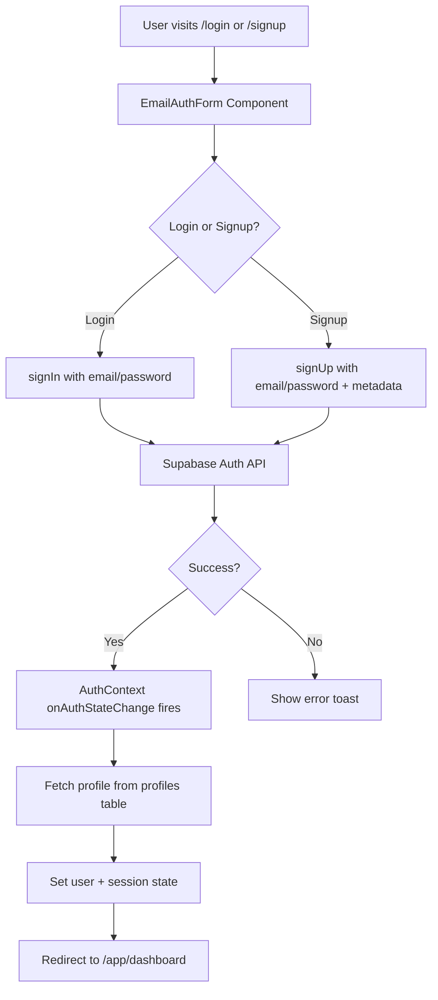
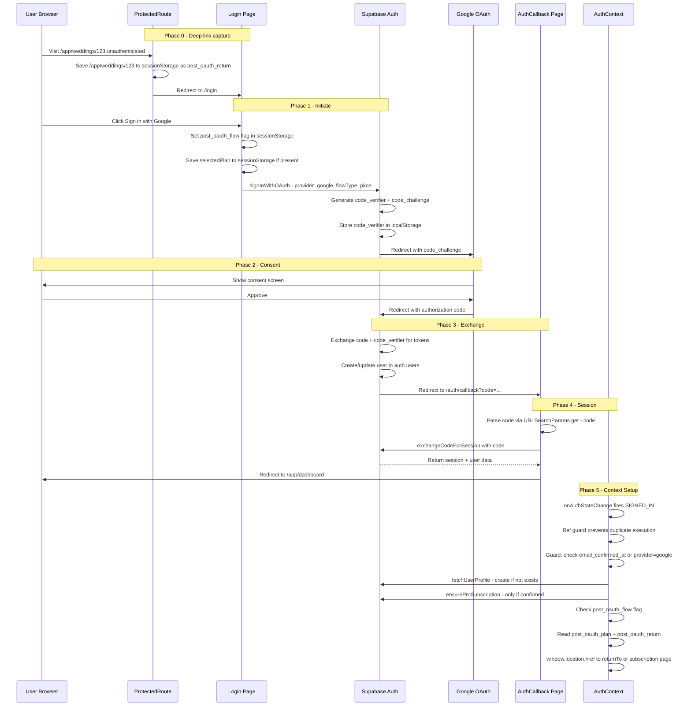
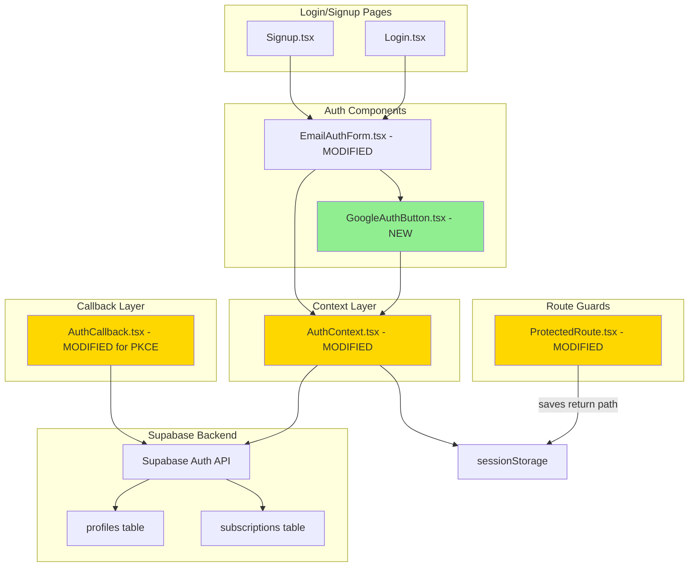

# Google OAuth Integration with Supabase — Architecture & Deployment Plan

## Table of Contents

1. [Executive Summary](#executive-summary)
2. [Current Architecture Analysis](#current-architecture-analysis)
3. [Proposed Architecture](#proposed-architecture)
4. [Authentication Lifecycle — Supabase-Managed](#authentication-lifecycle--supabase-managed)
5. [Files to Create or Modify](#files-to-create-or-modify)
6. [Detailed Implementation Specification](#detailed-implementation-specification)
7. [Step-by-Step Deployment Guide](#step-by-step-deployment-guide)
8. [Security Considerations](#security-considerations)
9. [Known Limitations & Edge Cases](#known-limitations--edge-cases)
10. [Troubleshooting](#troubleshooting)

---

## Executive Summary

This plan introduces **Google OAuth** as a sign-in option for the Knot To It Wedding Planner CRM. The integration relies entirely on **Supabase Auth** to manage the complete authentication lifecycle — including Google OAuth flow, password resets, email verification, account activation, and user sessions — with **zero custom backend logic**.

Key design decisions:
- **PKCE flow** (not implicit) for secure token exchange — tokens never appear in URLs
- **Account linking conflict handling** — specific error messages when a provider collision occurs
- **Plan + deep-link survival across OAuth redirect** — persisted via `sessionStorage`, recovered in `AuthContext` after session is fully established
- **Safety timeout** on `isAuthenticating` to prevent indefinite spinners (documented as intentional — no `clearTimeout` on success)
- **Double-click guard** — `if (isAuthenticating) return;` prevents duplicate `signInWithOAuth` calls
- **RLS-aware subscription provisioning** — guards for email confirmation status
- **Double SIGNED_IN protection** — ref guard prevents duplicate profile/subscription writes
- **Correct PKCE email confirmation** — handles `token_hash` + `type` query params, not hash fragments
- **Migration-safe AuthCallback** — transitional hash fragment fallback for users with pending pre-PKCE confirmation links
- **Atomic deployment** — Phase 0 (PKCE) and AuthCallback changes deployed together as a single unit
- **OAuth-only sessionStorage keys** — `post_oauth_flow` flag prevents non-OAuth logins from reading stale redirect state
- **Same-origin redirect validation** — `post_oauth_return` must start with `/` to prevent open redirect via XSS
- **Stale state cleanup** — `signInWithGoogle` clears previous OAuth state before writing fresh values

---

## Current Architecture Analysis

### Existing Auth Flow



### Key Existing Components

| Component | Path | Role |
|-----------|------|------|
| [`AuthProvider`](src/context/AuthContext.tsx:24) | `src/context/AuthContext.tsx` | Manages auth state, session, sign-in, sign-up, sign-out, password reset |
| [`EmailAuthForm`](src/components/auth/EmailAuthForm.tsx:19) | `src/components/auth/EmailAuthForm.tsx` | Login/signup form with email + password |
| [`AuthCallback`](src/pages/AuthCallback.tsx:7) | `src/pages/AuthCallback.tsx` | Handles OAuth redirects and email confirmation callbacks |
| [`ProtectedRoute`](src/components/ProtectedRoute.tsx:10) | `src/components/ProtectedRoute.tsx` | Guards authenticated routes |
| [`PublicRoute`](src/components/PublicRoute.tsx:10) | `src/components/PublicRoute.tsx` | Redirects authenticated users away from login/signup |
| [`supabase client`](src/integrations/supabase/client.ts:19) | `src/integrations/supabase/client.ts` | Supabase JS client with `detectSessionInUrl: true` |

### Observations

1. **Google login was previously removed** — Line 342 of [`AuthContext.tsx`](src/context/AuthContext.tsx:342) has the comment `// Google login method removed`. We are reintroducing it.
2. **AuthCallback needs PKCE update** — Must switch from `getSession()` to `exchangeCodeForSession()` and handle PKCE email confirmation links.
3. **Supabase client needs flow change** — [`client.ts`](src/integrations/supabase/client.ts:25) currently uses `flowType: 'implicit'`. Must change to `flowType: 'pkce'`.
4. **Profile auto-creation exists** — [`fetchUserProfile`](src/context/AuthContext.tsx:30) creates a profile if one does not exist, using `authUser.user_metadata` which Google OAuth populates with `full_name` and `avatar_url`.
5. **Complimentary Pro subscription** — [`ensureProSubscription`](src/context/AuthContext.tsx:173) provisions a 3-month Pro subscription on first sign-in. Needs email confirmation guard and double-fire protection.

---

## Proposed Architecture

### High-Level Google OAuth Flow with PKCE



### Component Architecture



---

## Authentication Lifecycle — Supabase-Managed

### 1. Google OAuth Sign-In Flow with PKCE

| Step | Handled By | Custom Code Required |
|------|-----------|---------------------|
| Generate PKCE code_verifier/challenge | Supabase JS client | No |
| Redirect to Google consent screen | `supabase.auth.signInWithOAuth()` | No — single API call |
| Code exchange for tokens | Supabase Auth server + `exchangeCodeForSession()` | Minimal — one API call in AuthCallback |
| User creation in `auth.users` | Supabase Auth | No |
| Session creation with JWT | Supabase Auth | No |
| Session persistence in localStorage | Supabase JS client (`persistSession: true`) | No |
| Session refresh before expiry | Supabase JS client (`autoRefreshToken: true`) | No |

**Why PKCE over Implicit**: Implicit flow leaks access tokens in the URL fragment — visible in browser history, server logs, and referrer headers. PKCE keeps the token exchange server-side and only exposes a short-lived authorization code in the URL.

### 2. Password Resets

Supabase handles password reset emails natively:

- [`resetPassword`](src/context/AuthContext.tsx:637) calls `supabase.auth.resetPasswordForEmail()`
- Supabase sends a password reset email with a secure link
- The link redirects to `/reset-password` where [`updatePassword`](src/context/AuthContext.tsx:651) calls `supabase.auth.updateUser()`
- **No custom backend needed** — Supabase manages token generation, email delivery, and token validation

### 3. Email Verification / Account Activation

Controlled via Supabase Dashboard → Authentication → Email settings:

- **Confirm email** toggle: When ON, users must verify their email before getting a session
- Supabase sends verification emails automatically
- In PKCE mode, email confirmation links arrive with `?token_hash=` and `?type=` query params (NOT hash fragments)
- AuthCallback handles these via `supabase.auth.verifyOtp({ token_hash, type })` with validated type casting
- **Google OAuth users are exempt** — Google accounts are auto-confirmed since Google has already verified the email

### 4. User Sessions

Fully managed by the Supabase JS client:

| Feature | Configuration | Location |
|---------|--------------|----------|
| Session persistence | `persistSession: true` | [`client.ts`](src/integrations/supabase/client.ts:22) |
| Auto token refresh | `autoRefreshToken: true` | [`client.ts`](src/integrations/supabase/client.ts:21) |
| URL-based session detection | `detectSessionInUrl: true` | [`client.ts`](src/integrations/supabase/client.ts:23) |
| OAuth flow type | `flowType: 'pkce'` — **to be changed** | [`client.ts`](src/integrations/supabase/client.ts:25) |
| Session state listener | `onAuthStateChange` | [`AuthContext.tsx`](src/context/AuthContext.tsx:218) |

### 5. Account Linking

Supabase can automatically link accounts by email:

- Enable "Link accounts by email" in Supabase Dashboard → Authentication → Providers → Google
- If linking is **disabled** and a conflict exists, `signInWithOAuth` returns `provider_email_exists` — we handle this with a specific error message
- If linking is **enabled**, Supabase merges the identities automatically

### 6. Sign-Out Behavior

**Important**: `supabase.auth.signOut()` ends the Supabase session but does **not** revoke the Google OAuth token. The user remains signed into Google in their browser. This is standard behavior for OAuth integrations and is acceptable for this application. A note will be displayed to the user if needed.

---

## Files to Create or Modify

### New Files

| File | Purpose |
|------|---------|
| `src/components/auth/GoogleAuthButton.tsx` | Reusable Google sign-in button component |
| `docs/google-oauth-setup.md` | Deployment and configuration guide |

### Modified Files

| File | Change |
|------|--------|
| [`src/integrations/supabase/client.ts`](src/integrations/supabase/client.ts) | Change `flowType: 'implicit'` to `flowType: 'pkce'` |
| [`src/context/AuthContext.tsx`](src/context/AuthContext.tsx) | Add `signInWithGoogle`; add email confirmation guard to `ensureProSubscription`; add double-fire ref guard; recover plan + return from sessionStorage using `post_oauth_flow` flag; use `window.location.href` instead of `navigate` |
| [`src/components/auth/EmailAuthForm.tsx`](src/components/auth/EmailAuthForm.tsx) | Integrate `GoogleAuthButton` above the email form with an "or" divider |
| [`src/pages/AuthCallback.tsx`](src/pages/AuthCallback.tsx) | Replace `getSession()` with `exchangeCodeForSession()` for OAuth codes; add `verifyOtp()` for PKCE email confirmation with validated type casting; add transitional hash fragment fallback for migration; add specific expired-code error message |
| [`src/components/ProtectedRoute.tsx`](src/components/ProtectedRoute.tsx) | Save `location.pathname + location.search` to `sessionStorage` as `post_oauth_return` before redirecting to login |
| [`src/locales/en/common.json`](src/locales/en/common.json) | Add English translations for Google auth strings |
| [`src/locales/fr/common.json`](src/locales/fr/common.json) | Add French translations for Google auth strings |

### Files That Remain Unchanged

| File | Reason |
|------|--------|
| [`src/components/PublicRoute.tsx`](src/components/PublicRoute.tsx) | Works with any Supabase session, regardless of provider |
| [`src/routes.tsx`](src/routes.tsx) | `/auth/callback` route already exists via `App.tsx` |
| [`vercel.json`](vercel.json) | SPA rewrite already handles all routes |

---

## Detailed Implementation Specification

### 1. Update Supabase Client — Switch to PKCE

**File**: [`src/integrations/supabase/client.ts`](src/integrations/supabase/client.ts)

Change line 25:
```typescript
// Before
flowType: 'implicit',

// After
flowType: 'pkce',
```

This is a one-line change. The Supabase JS client v2 handles PKCE code verifier storage in `localStorage` automatically.

### 2. Save Deep Link in ProtectedRoute

**File**: [`src/components/ProtectedRoute.tsx`](src/components/ProtectedRoute.tsx)

Before redirecting unauthenticated users to `/login`, save their intended destination to `sessionStorage`:

```typescript
// In ProtectedRoute, before the Navigate redirect:
if (!user || !session) {
  // Save the intended destination for post-OAuth redirect
  sessionStorage.setItem('post_oauth_return', location.pathname + location.search);
  return <Navigate to="/login" state={{ from: location }} replace />;
}
```

This captures the deep link at the right moment — when the user tries to access a protected route — rather than trying to recover it later from `window.history.state` which doesn't work across React Router navigations.

### 3. Create `GoogleAuthButton` Component

**File**: `src/components/auth/GoogleAuthButton.tsx`

A self-contained button component that:
- Accepts optional `selectedPlan` prop to persist across OAuth redirect
- Calls `useAuth().signInWithGoogle()` on click
- Shows loading spinner during authentication
- Renders the official Google "G" SVG icon alongside localized text

### 4. Add `signInWithGoogle` to AuthContext

**File**: [`src/context/AuthContext.tsx`](src/context/AuthContext.tsx)

Changes:
- Add `signInWithGoogle: (options?: { plan?: string }) => Promise<void>` to `AuthContextType`
- Implement with:
  - `sessionStorage.setItem('post_oauth_flow', 'true')` — flag to distinguish OAuth logins from email logins
  - `sessionStorage.setItem('post_oauth_plan', plan)` if plan is provided
  - 10-second safety timeout on `isAuthenticating`
  - Specific error handling for `provider_email_exists`
  - Call `supabase.auth.signInWithOAuth({ provider: 'google', options: { redirectTo } })`

```typescript
const signInWithGoogle = async (options?: { plan?: string }) => {
  // Prevent double-click — calling signInWithOAuth twice generates two
  // PKCE code verifiers; the first redirect will fail with verifier mismatch.
  if (isAuthenticating) return;

  setIsAuthenticating(true);

  // Clear any stale OAuth state from previous abandoned attempts.
  // Without this, a user who abandons the Google consent screen and later
  // clicks Google again from a different page would be sent to the old page.
  sessionStorage.removeItem('post_oauth_return');
  sessionStorage.removeItem('post_oauth_plan');

  // Set OAuth flow flag — distinguishes from email/password logins
  // so onAuthStateChange only reads post_oauth_return for OAuth flows
  sessionStorage.setItem('post_oauth_flow', 'true');

  // Persist selected plan across OAuth redirect
  if (options?.plan) {
    sessionStorage.setItem('post_oauth_plan', options.plan);
  }

  // NOTE: post_oauth_return is already set by ProtectedRoute when the user
  // was redirected to /login. We don't need to set it here.

  // Safety timeout — if redirect fails or is blocked, stop the spinner.
  // NOTE: We intentionally do NOT clearTimeout on success. On success,
  // the page navigates away to Google and the timeout fires harmlessly
  // in the old page context. Adding clearTimeout on success would cause
  // the spinner to disappear before the redirect completes (jarring UX).
  const timeout = setTimeout(() => setIsAuthenticating(false), 10_000);

  try {
    const { error } = await supabase.auth.signInWithOAuth({
      provider: 'google',
      options: {
        redirectTo: `${window.location.origin}/auth/callback`,
      }
    });

    if (error) {
      clearTimeout(timeout);

      // Handle account linking conflict
      if (error.message.includes('provider_email_exists')) {
        toast({
          title: t('auth.accountAlreadyExists'),
          description: t('auth.accountAlreadyExistsDescription'),
          variant: 'destructive',
        });
      } else {
        toast({
          title: t('auth.googleSigninFailed'),
          description: error.message,
          variant: 'destructive',
        });
      }
      setIsAuthenticating(false);
    }
    // On success: page redirects to Google. isAuthenticating resets on new page load.
    // The timeout fires harmlessly in the old page context — this is intentional.
  } catch (err) {
    clearTimeout(timeout);
    setIsAuthenticating(false);
  }
};
```

### 5. Add Email Confirmation Guard + Double-Fire Protection to `ensureProSubscription`

**File**: [`src/context/AuthContext.tsx`](src/context/AuthContext.tsx)

**5a. Double-fire protection** — Add a ref to prevent `ensureProSubscription` from running twice when `SIGNED_IN` fires multiple times:

```typescript
const isProvisioningRef = useRef(false);

// In the onAuthStateChange SIGNED_IN handler:
if (!isProvisioningRef.current) {
  isProvisioningRef.current = true;
  try {
    await fetchUserProfile(currentSession.user.id);
    await ensureProSubscription(currentSession.user.id);
  } finally {
    isProvisioningRef.current = false;
  }
}
```

**5b. Email confirmation guard** — Modify [`ensureProSubscription`](src/context/AuthContext.tsx:173) to skip provisioning when email is not confirmed and the user didn't sign in via Google:

```typescript
const ensureProSubscription = async (userId: string) => {
  try {
    // Get current user to check confirmation status
    const { data: { user: authUser } } = await supabase.auth.getUser();
    if (!authUser) return;

    // Skip if email not confirmed and not an OAuth provider.
    // Google OAuth users are auto-confirmed by the provider.
    const isOAuth = authUser.app_metadata?.provider === 'google';
    const emailConfirmed = !!authUser.email_confirmed_at;

    if (!emailConfirmed && !isOAuth) {
      console.log('Skipping subscription provisioning — email not yet confirmed');
      return;
    }

    // Check existence (idempotent — safe to call multiple times).
    // Note: .maybeSingle() requires @supabase/supabase-js v2.x which bundles
    // a compatible @supabase/postgrest-js. Verify with: npm list @supabase/supabase-js
    const { data: existing, error: checkError } = await supabase
      .from('subscriptions')
      .select('id')
      .eq('user_id', userId)
      .limit(1)
      .maybeSingle();

    if (checkError) {
      console.error('Error checking existing subscription:', checkError);
      return;
    }
    if (existing) return; // Already provisioned — skip

    // ... rest of existing insert logic
  } catch (err) {
    console.error('Unexpected error provisioning subscription:', err);
  }
};
```

### 6. Recover Plan + Return Path in AuthContext (NOT AuthCallback)

**File**: [`src/context/AuthContext.tsx`](src/context/AuthContext.tsx)

The plan and return path recovery happens in `onAuthStateChange`, **after** `fetchUserProfile` and `ensureProSubscription` have completed. This avoids the race condition where the subscription page loads before the user context is fully established.

**Critical**: We use `window.location.href` instead of `navigate()` because `useNavigate()` is not available inside `AuthProvider` when it wraps the router. The `AuthProvider` is a parent of the router in the component tree.

**Critical**: We only read `post_oauth_return` when the `post_oauth_flow` flag is present. This prevents email/password logins from being redirected to stale deep links.

```typescript
// Inside onAuthStateChange, after profile fetch and subscription provisioning:
if (event === 'SIGNED_IN') {
  const isOAuthFlow = sessionStorage.getItem('post_oauth_flow');

  if (isOAuthFlow) {
    sessionStorage.removeItem('post_oauth_flow');

    const savedPlan = sessionStorage.getItem('post_oauth_plan');
    const savedReturn = sessionStorage.getItem('post_oauth_return');

    // Same-origin check — only allow relative paths starting with '/'.
    // Prevents open redirect if sessionStorage is tampered with via XSS.
    const isSafeReturn = savedReturn?.startsWith('/');

    if (savedPlan) {
      sessionStorage.removeItem('post_oauth_plan');
      sessionStorage.removeItem('post_oauth_return');
      window.location.href = `${window.location.origin}/account/subscription?plan=${savedPlan}`;
    } else if (savedReturn && isSafeReturn && savedReturn !== '/app/dashboard') {
      sessionStorage.removeItem('post_oauth_return');
      window.location.href = `${window.location.origin}${savedReturn}`;
    }
  }
}
```

### 7. Update AuthCallback for PKCE + Email Confirmation + Migration Fallback

**File**: [`src/pages/AuthCallback.tsx`](src/pages/AuthCallback.tsx)

The callback handles four cases:
1. **OAuth redirect** — `?code=` param → `exchangeCodeForSession(code)`
2. **Email confirmation in PKCE mode** — `?token_hash=` + `?type=` params → `verifyOtp({ token_hash, type })`
3. **Transitional fallback** — hash fragment with `access_token` for users with pending pre-PKCE confirmation links (remove after 7 days)
4. **No recognizable params** — redirect to login

```typescript
import type { EmailOtpType } from '@supabase/supabase-js';

const handleAuthCallback = async () => {
  try {
    const queryParams = new URLSearchParams(window.location.search);
    const errorParam = queryParams.get('error');
    const errorDescription = queryParams.get('error_description');
    const code = queryParams.get('code');
    const tokenHash = queryParams.get('token_hash');
    const type = queryParams.get('type');

    // Check for error params
    if (errorParam) {
      setError(`Authentication error: ${errorDescription || errorParam}`);
      setIsProcessing(false);
      return;
    }

    // Case 1: OAuth redirect with PKCE code
    if (code) {
      const { data, error } = await supabase.auth.exchangeCodeForSession(code);
      if (error) {
        // Specific error for expired/already-used codes
        if (error.message.includes('code verifier') || error.message.includes('expired')) {
          setError('This sign-in link has expired. Please try signing in again.');
        } else {
          setError('There was a problem completing your sign in. Please try again.');
        }
        setIsProcessing(false);
        return;
      }
      if (data.session) {
        // Session established — redirect to dashboard.
        // AuthContext.onAuthStateChange will handle plan/return recovery.
        window.location.href = `${window.location.origin}/app/dashboard`;
        return;
      }
    }

    // Case 2: Email confirmation in PKCE mode
    if (tokenHash && type) {
      // Validate type before casting — protects against malicious query params
      const validTypes: string[] = ['signup', 'email', 'recovery', 'invite', 'magiclink', 'email_change'];
      if (!validTypes.includes(type)) {
        navigate('/login', { replace: true });
        return;
      }

      const { data, error } = await supabase.auth.verifyOtp({
        token_hash: tokenHash,
        type: type as EmailOtpType,
      });
      if (error) {
        setError('There was a problem verifying your email. Please try again.');
        setIsProcessing(false);
        return;
      }
      if (data.session) {
        window.location.href = `${window.location.origin}/app/dashboard`;
        return;
      }
    }

    // Case 3: Transitional fallback for pre-PKCE confirmation links.
    // TODO: Remove this block once all pre-PKCE confirmation emails have expired.
    // Supabase confirmation links expire after 24 hours by default.
    // This fallback can be removed 24–48 hours after the PKCE migration deploys.
    // Users who received email confirmation links before the PKCE migration
    // will have hash-fragment-based URLs that need this fallback.
    const hash = window.location.hash;
    if (hash && hash.includes('access_token')) {
      const { data } = await supabase.auth.getSession();
      if (data.session) {
        window.location.href = `${window.location.origin}/app/dashboard`;
        return;
      }
    }

    // Case 4: No recognizable auth params
    navigate('/login', { replace: true });
  } catch (error) {
    setError('An unexpected error occurred. Please try again.');
    setIsProcessing(false);
  }
};
```

### 8. Update `EmailAuthForm` to Include Google Button

**File**: [`src/components/auth/EmailAuthForm.tsx`](src/components/auth/EmailAuthForm.tsx)

Changes:
- Import `GoogleAuthButton`
- Add the button above the tabs/card with a visual "or" divider
- Pass `selectedPlan` through to preserve the plan across OAuth redirect

### 9. Add i18n Translations

**English** ([`src/locales/en/common.json`](src/locales/en/common.json)) — add to `auth` section:
```json
"continueWithGoogle": "Continue with Google",
"googleSigninFailed": "Google sign-in failed",
"googleSigninFailedDescription": "There was a problem signing in with Google. Please try again.",
"accountAlreadyExists": "Account already exists",
"accountAlreadyExistsDescription": "Sign in with your email and password, then link Google from your account settings.",
"or": "or",
"signinLinkExpired": "This sign-in link has expired. Please try signing in again."
```

**French** ([`src/locales/fr/common.json`](src/locales/fr/common.json)) — add to `auth` section:
```json
"continueWithGoogle": "Continuer avec Google",
"googleSigninFailed": "Échec de la connexion Google",
"googleSigninFailedDescription": "Un problème est survenu lors de la connexion avec Google. Veuillez réessayer.",
"accountAlreadyExists": "Compte déjà existant",
"accountAlreadyExistsDescription": "Connectez-vous avec votre email et mot de passe, puis associez Google depuis vos paramètres.",
"or": "ou",
"signinLinkExpired": "Ce lien de connexion a expiré. Veuillez réessayer de vous connecter."
```

---

## Step-by-Step Deployment Guide

### Phase 0: Pre-Flight — Switch to PKCE (Atomic with AuthCallback Update)

> **Critical**: The `flowType` change in `client.ts` and the `AuthCallback.tsx` rewrite MUST be deployed together as a single atomic change. Rolling back one without the other will break authentication.
>
> **Also**: Existing users with active sessions stored as implicit-flow tokens will continue to work — the Supabase JS client reads those sessions fine regardless of `flowType`. However, users with pending email confirmation links sent before the migration will have hash-fragment URLs. The transitional fallback in AuthCallback handles this. Remove the fallback after 7 days.

1. Change `flowType` to `'pkce'` in [`client.ts`](src/integrations/supabase/client.ts:25)
2. Rewrite [`AuthCallback.tsx`](src/pages/AuthCallback.tsx) with the four-case handler (PKCE code, PKCE email confirmation, transitional hash fallback, no params)
3. Update [`ProtectedRoute.tsx`](src/components/ProtectedRoute.tsx) to save deep link to sessionStorage
4. Test existing email/password login to confirm nothing breaks
5. Test email verification flow to confirm PKCE handles confirmation links correctly
6. **Rollback plan**: If issues arise, revert both `client.ts` and `AuthCallback.tsx` together

### Phase 1: Google Cloud Console Setup

7. **Create a Google Cloud Project** (or use an existing one)
   - Go to [Google Cloud Console](https://console.cloud.google.com/)
   - Click "Select a project" → "New Project"
   - Name it e.g. "Knot To It Auth" and click "Create"

8. **Configure OAuth Consent Screen**
   - Navigate to "APIs & Services" → "OAuth consent screen"
   - Choose "External" user type
   - Fill in required fields:
     - App name: "Knot To It"
     - User support email: your email
     - Developer contact email: your email
   - Add scopes: `email`, `profile`, `openid`
   - Add test users if in testing mode
   - Click "Save and Continue"

9. **Create OAuth 2.0 Credentials**
   - Navigate to "APIs & Services" → "Credentials"
   - Click "Create Credentials" → "OAuth client ID"
   - Application type: "Web application"
   - Name: "Knot To It - Supabase"
   - **Authorized JavaScript origins**:
     - `https://knot-master.vercel.app` (production only)
   - **Authorized redirect URIs**:
     - `https://zkrtaixltensetceanmv.supabase.co/auth/v1/callback`
   - Click "Create"
   - **Copy the Client ID and Client Secret**

   > **Important**: Do NOT add local dev URLs to the production Google OAuth credentials. Create a separate set of credentials for local development if needed.

### Phase 2: Supabase Dashboard Configuration

10. **Enable Google Provider in Supabase**
    - Go to [Supabase Dashboard](https://app.supabase.com/)
    - Select your project (`zkrtaixltensetceanmv`)
    - Navigate to "Authentication" → "Providers"
    - Click on "Google"
    - Toggle "Enable Google provider" to ON
    - Paste the **Client ID** and **Client Secret** from Step 9
    - Click "Save"

11. **Configure Redirect URLs — Production Only**
    - Navigate to "Authentication" → "URL Configuration"
    - Set **Site URL** to: `https://knot-master.vercel.app`
    - Add **Redirect URLs** (production only):
      ```
      https://knot-master.vercel.app/auth/callback
      ```
    - Click "Save"

    > **Note**: Local development URLs should be configured in a separate `.env.local` file pointing to a local or staging Supabase instance, not mixed into the production project.

12. **Configure Email Settings** (for password reset and verification)
    - Navigate to "Authentication" → "Email Templates"
    - Customize templates for: Confirm signup, Reset password, Magic link
    - Ensure SMTP is configured

13. **Configure Account Linking**
    - In "Authentication" → "Providers" → "Google"
    - Enable "Link accounts with same email" to allow users who signed up with email to also use Google login

### Phase 3: Deploy Code Changes

14. **Deploy the frontend code**
    - Merge all code changes to the main branch as a single commit
    - Vercel auto-deploys from Git

15. **Verify environment variables in Vercel**
    - Ensure `VITE_SUPABASE_URL` and `VITE_SUPABASE_ANON_KEY` are set in Vercel Dashboard → Settings → Environment Variables
    - No new environment variables are needed for Google OAuth

### Phase 4: Testing

16. **Test Google OAuth Flow**
    - Visit `https://knot-master.vercel.app/login`
    - Click "Continue with Google"
    - Complete Google consent screen
    - Verify redirect to `/auth/callback?code=...` then to `/app/dashboard`
    - Check that user profile is created in the `profiles` table
    - Check that complimentary Pro subscription is provisioned

17. **Test Account Linking**
    - Sign up with email `test@example.com`
    - Sign out
    - Sign in with Google using the same email
    - Verify the accounts are linked (same user ID)

18. **Test Account Linking Conflict** (if linking is disabled)
    - Sign up with email `test@example.com`
    - Sign out
    - Try signing in with Google using the same email
    - Verify the specific "Account already exists" error message is shown

19. **Test Plan Persistence**
    - Visit `/signup?plan=premium`
    - Click "Continue with Google"
    - Complete OAuth flow
    - Verify redirect to `/account/subscription?plan=premium`

20. **Test Deep Link Return**
    - While logged out, try visiting `/app/clients` (should redirect to login)
    - Click "Continue with Google"
    - Complete OAuth flow
    - Verify redirect to `/app/clients` (not just dashboard)

21. **Test Email Confirmation in PKCE Mode**
    - Sign up with email/password (with email confirmation enabled)
    - Click the confirmation link in the email
    - Verify the link has `?token_hash=` and `?type=` params
    - Verify AuthCallback processes it correctly via `verifyOtp()`

22. **Test Email Login Not Affected by OAuth State**
    - While logged out, visit `/app/clients` (saves `post_oauth_return`)
    - On login page, sign in with email/password (NOT Google)
    - Verify redirect to `/app/dashboard` (NOT `/app/clients`)
    - This confirms `post_oauth_flow` flag prevents stale redirect on non-OAuth logins

23. **Test Rollback** (pre-deployment)
    - Revert `client.ts` and `AuthCallback.tsx` together
    - Verify email/password login still works
    - This confirms the rollback procedure is viable

24. **Test Error Scenarios**
    - Deny Google consent → verify error is shown
    - Try signing in with Google when already signed in → verify redirect to dashboard
    - Test on mobile browser → verify responsive layout

### Phase 5: Production Readiness

25. **Publish OAuth Consent Screen** (Google Cloud Console)
    - If your app is in "Testing" mode, publish it to "Production"
    - This removes the 100-user limit and test user restrictions

26. **Monitor and Verify**
    - Check Supabase Dashboard → Authentication → Users for new Google OAuth users
    - Verify `provider` column shows `google` for OAuth users
    - Monitor Supabase logs for any auth errors

27. **Remove Transitional Fallback** (after 7 days)
    - Remove the hash-fragment fallback block in `AuthCallback.tsx`
    - Add a comment noting the removal date

---

## Security Considerations

1. **PKCE flow** — Tokens are never exposed in URLs. The code verifier is stored in `localStorage` and exchanged server-side.
2. **No custom backend secrets** — The Google Client Secret is stored only in Supabase Dashboard, never exposed to the frontend.
3. **Row Level Security** — Existing RLS policies on `profiles` and `subscriptions` tables apply equally to Google OAuth users since they use the same `auth.uid()` mechanism.
4. **Token validation** — Supabase validates JWTs on every API request; no additional validation is needed.
5. **Redirect URL validation** — Supabase strictly validates redirect URLs against the allowlist configured in the dashboard.
6. **Email confirmation guard** — `ensureProSubscription` skips provisioning for non-OAuth users without confirmed emails, preventing abuse of unverified accounts.
7. **Safety timeout** — `isAuthenticating` resets after 10 seconds if the OAuth redirect is blocked or fails silently. The timeout is intentionally not cleared on success — it fires harmlessly after the page navigates away.
8. **Double-fire protection** — A ref guard prevents `fetchUserProfile` and `ensureProSubscription` from running twice when `onAuthStateChange` fires `SIGNED_IN` multiple times.
9. **CSP headers** — Ensure your Content Security Policy allows navigation to `accounts.google.com`. If `form-action` or `frame-ancestors` directives are too restrictive, the OAuth redirect will silently fail.
10. **OTP type validation** — The `verifyOtp` type parameter is validated against a whitelist before casting, preventing injection of malicious query params.
11. **OAuth-only sessionStorage reads** — The `post_oauth_flow` flag ensures that email/password logins are not affected by stale OAuth redirect state.

---

## Known Limitations & Edge Cases

| Scenario | Behavior | Mitigation |
|----------|----------|------------|
| Google sign-out does not revoke Supabase session | User remains logged into the app | Standard OAuth behavior; document for support |
| `supabase.auth.signOut()` does not revoke Google token | User remains signed into Google in their browser | Acceptable; true single sign-out would redirect to `accounts.google.com/Logout` which is aggressive |
| Account linking conflict when disabled | `provider_email_exists` error | Specific error message guides user to sign in with email first |
| `selectedPlan` lost if sessionStorage is cleared | User lands on dashboard instead of subscription page | Acceptable edge case; sessionStorage survives page navigations |
| Popup/redirect blocked by browser | `isAuthenticating` spinner hangs | 10-second safety timeout resets the state |
| Multiple Google accounts | User picks the wrong account | Standard Google account picker handles this |
| Local dev with production Supabase | Local redirect URLs not in allowlist | Use separate dev Supabase project or add dev URLs temporarily |
| CSP blocks navigation to accounts.google.com | Nothing happens on button click | Check `form-action` and `frame-ancestors` CSP directives |
| `SIGNED_IN` fires twice | Duplicate profile/subscription writes | Ref guard in AuthContext prevents double execution |
| Pre-PKCE confirmation links | Hash fragment URLs from before migration | Transitional fallback in AuthCallback; remove after 7 days |
| Email login reads stale OAuth redirect | User redirected to wrong page | `post_oauth_flow` flag ensures only OAuth logins read redirect state |
| PKCE code expires | User bookmarks callback URL or is slow | Specific "link expired" error message |

---

## Troubleshooting

| Issue | Cause | Solution |
|-------|-------|----------|
| "Invalid login credentials" after Google redirect | Redirect URL mismatch | Verify redirect URLs in both Google Cloud Console and Supabase Dashboard |
| Blank page after Google login | AuthCallback not processing code | Check browser console; verify `exchangeCodeForSession` is called with the code param |
| "code not found" error | PKCE code verifier missing from localStorage | Clear localStorage and retry; check for browser privacy extensions |
| "This sign-in link has expired" | PKCE code was already used or expired | Normal behavior — user should start a new sign-in |
| Email confirmation link shows blank page | Hash fragment expected but PKCE sends query params | Verify AuthCallback handles `token_hash` + `type` params via `verifyOtp()` |
| Pre-migration confirmation link fails | Hash fragment URL from before PKCE switch | Transitional fallback should handle it; verify the fallback block is present |
| Profile not created | RLS policy blocking INSERT | Verify `profiles` table has an INSERT policy for `auth.uid()` |
| "Email not confirmed" error for Google users | Email confirmation required globally | Google OAuth users should be auto-confirmed; check Supabase provider settings |
| Session not persisting | Cookie/localStorage blocked | Check browser privacy settings; ensure same-site cookie policy allows it |
| Google consent screen shows "unverified app" | OAuth app in testing mode | Publish the OAuth consent screen in Google Cloud Console |
| `provider_email_exists` error | Account linking disabled + email conflict | Enable account linking in Supabase, or guide user to sign in with email first |
| Spinner hangs after clicking Google button | Redirect blocked by popup blocker | 10-second safety timeout will reset; user should allow popups/redirects |
| Nothing happens on Google button click | CSP blocks navigation to accounts.google.com | Check `form-action` and `frame-ancestors` CSP directives in your deployment |
| Duplicate subscription rows | `SIGNED_IN` fired twice without ref guard | Verify `isProvisioningRef` guard is in place in AuthContext |
| Email login redirects to wrong page | Stale `post_oauth_return` in sessionStorage | Verify `post_oauth_flow` flag is checked before reading redirect state |
