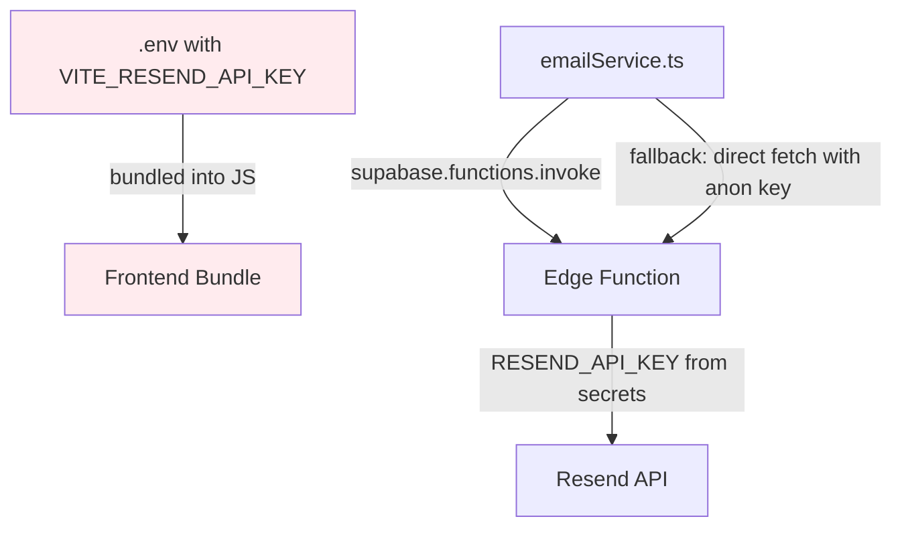
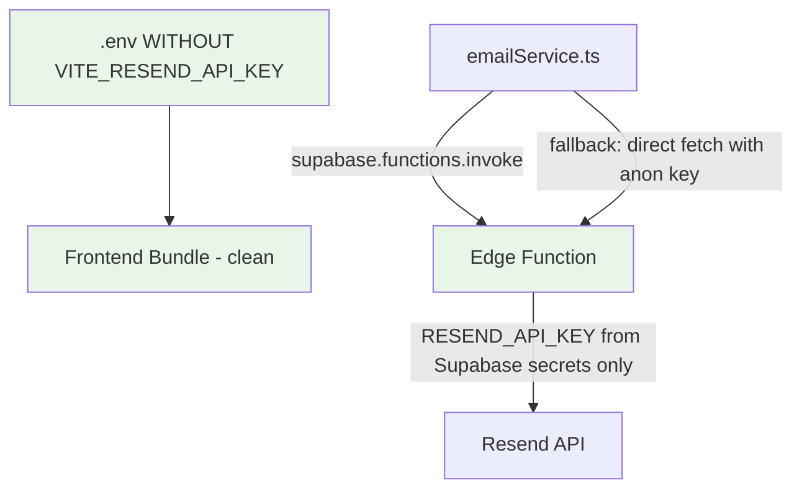

# Resend Integration: Security Fix & Optimization Plan

## 1. Issues Identified in Current Implementation

### 1.1 🔴 CRITICAL: API Key Exposed in Frontend Bundle

**File:** [`.env`](.env:4)

```
VITE_RESEND_API_KEY=re_boaNUsLQ_7gAyjj95oHorrew4NeMd6U7P
```

Any variable prefixed with `VITE_` is embedded in the production JavaScript bundle at build time. Anyone can extract it by inspecting the browser dev tools or the bundled JS files.

**Current usage in frontend:** The key is defined in `.env` but is **not actually imported** in [`emailService.ts`](src/services/emailService.ts) — the service only calls the Edge Function. However, the key still gets bundled because Vite includes all `VITE_` variables.

### 1.2 ⚠️ MEDIUM: Duplicate HTML Templates

HTML email templates exist in **two places**:
- [`supabase/functions/resend-email/index.ts`](supabase/functions/resend-email/index.ts:215) — Edge Function templates (actually used)
- [`src/services/emailService.ts`](src/services/emailService.ts:212) — Frontend templates (never used, dead code)

The frontend templates in `emailService.ts` are dead code because the Edge Function handles all template rendering.

### 1.3 ⚠️ MEDIUM: Hardcoded API Keys in Batch Scripts

**File:** [`deploy-resend-function.bat`](deploy-resend-function.bat:10)

```batch
supabase secrets set RESEND_API_KEY=re_RrTyet8W_894eJUvcj5r5yohQeSkD7Ezc
```

An old Resend API key is hardcoded in a deployment script. This should use an environment variable reference instead.

### 1.4 🟢 LOW: Default Sender Email

**File:** [`supabase/functions/resend-email/index.ts`](supabase/functions/resend-email/index.ts:50)

```typescript
const DEFAULT_FROM_EMAIL = 'onboarding@resend.dev';
```

Using Resend's default sender means emails can only be sent to your account's verified email unless you verify a custom domain. For production, this should be updated to your verified domain email.

### 1.5 🟢 LOW: Obsolete `email-server/` Directory

The [`email-server/`](email-server/server.js) directory contains a standalone Express server that proxies to Resend API. It is not used in production and can be removed.

---

## 2. Architecture: Current vs. Fixed

### Current Flow (with security issue)



### Fixed Flow (API key removed from frontend)



---

## 3. Step-by-Step Implementation Plan

### Step 1: Remove `VITE_RESEND_API_KEY` from `.env`

**File:** [`.env`](.env)

Remove line 4:
```
VITE_RESEND_API_KEY=re_boaNUsLQ_7gAyjj95oHorrew4NeMd6U7P
```

The `RESEND_API_KEY` already exists as a Supabase Edge Function secret (set via `supabase secrets set`). The Edge Function reads it with `Deno.env.get('RESEND_API_KEY')` at [line 40](supabase/functions/resend-email/index.ts:40). No frontend code needs this key.

### Step 2: Remove dead code from `emailService.ts`

**File:** [`src/services/emailService.ts`](src/services/emailService.ts)

Remove the following unused code:
- Lines 7-10: Comment and `DEFAULT_FROM_EMAIL` constant (not used in any function call — the Edge Function has its own default)
- Lines 12-13: `EDGE_FUNCTION_URL` constant (only used in fallback fetch calls — see Step 3)
- Lines 209-434: All three HTML template functions (`getSignatureRequestEmailTemplate`, `getTestEmailTemplate`, `getSignatureConfirmationEmailTemplate`) — these are dead code since templates are rendered server-side in the Edge Function

### Step 3: Simplify fallback logic in `emailService.ts`

Currently each function has a dual-path pattern:
1. Try `supabase.functions.invoke('resend-email', ...)` 
2. If that fails, fall back to direct `fetch(EDGE_FUNCTION_URL, ...)`

The fallback was added to work around CORS issues. Since the Edge Function already has proper CORS handling at [lines 6-37](supabase/functions/resend-email/index.ts:6), the fallback is likely unnecessary. However, to be safe, we can keep it but simplify:

- Replace `EDGE_FUNCTION_URL` construction with a dynamic one derived from the Supabase URL already available through the client
- Remove `DEFAULT_FROM_EMAIL` from fallback request bodies (the Edge Function has its own default)

### Step 4: Fix hardcoded API key in deployment script

**File:** [`deploy-resend-function.bat`](deploy-resend-function.bat:10)

Change:
```batch
supabase secrets set RESEND_API_KEY=re_RrTyet8W_894eJUvcj5r5yohQeSkD7Ezc
```

To:
```batch
supabase secrets set RESEND_API_KEY=%RESEND_API_KEY%
```

This reads the key from the system environment instead of hardcoding it.

### Step 5: Clean up obsolete files

| File/Directory | Action | Reason |
|----------------|--------|--------|
| [`email-server/`](email-server/server.js) | Delete | Standalone Express proxy, not used in production |
| [`test-email-function.js`](test-email-function.js) | Update or delete | Uses hardcoded URL and no auth header |

### Step 6: Verify Edge Function secret is set

Confirm that `RESEND_API_KEY` is set as a Supabase secret:
```bash
supabase secrets list --project-ref zkrtaixltensetceanmv
```

If not set, set it:
```bash
supabase secrets set RESEND_API_KEY=your_current_key --project-ref zkrtaixltensetceanmv
```

### Step 7: Update documentation

Update the following files to reflect the security fix:
- [`README_EMAIL_INTEGRATION.md`](README_EMAIL_INTEGRATION.md) — Remove references to `VITE_RESEND_API_KEY`
- [`README_SUPABASE_EMAIL_SETUP.md`](README_SUPABASE_EMAIL_SETUP.md) — Clarify that the API key is server-side only

---

## 4. Optional Future Improvements (Out of Scope)

These are not part of this task but worth noting for future consideration:

1. **Verify a custom domain in Resend** — Replace `onboarding@resend.dev` with your own domain to send to any email address
2. **Add email delivery webhooks** — Track bounces and opens via Resend webhooks
3. **Add retry logic with backoff** — For transient Edge Function failures
4. **Add email queue for bulk sends** — If you ever need to send batch emails

---

## 5. Files Changed Summary

| File | Change | Risk |
|------|--------|------|
| [`.env`](.env) | Remove `VITE_RESEND_API_KEY` line | 🟢 None — key not used by frontend code |
| [`src/services/emailService.ts`](src/services/emailService.ts) | Remove dead templates, simplify fallback | 🟢 Low — removing unused code |
| [`deploy-resend-function.bat`](deploy-resend-function.bat) | Use env var reference instead of hardcoded key | 🟢 None |
| [`email-server/`](email-server/server.js) | Delete directory | 🟢 None — not used in production |
| [`README_EMAIL_INTEGRATION.md`](README_EMAIL_INTEGRATION.md) | Update docs | 🟢 None |
