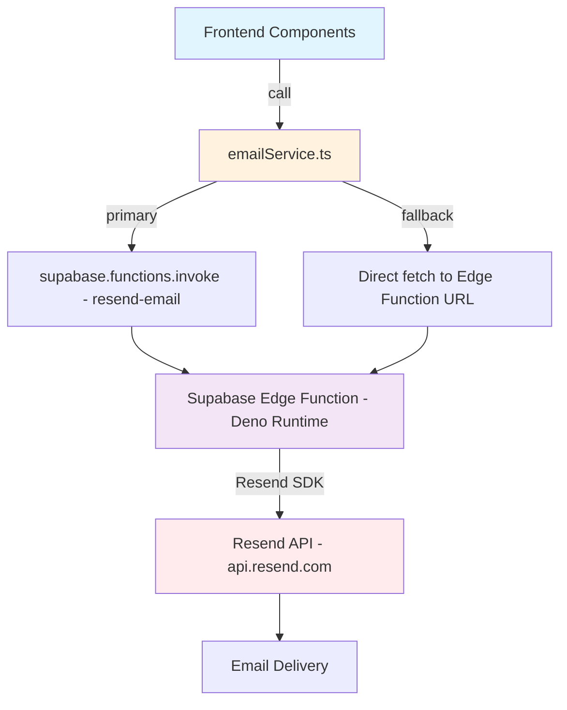
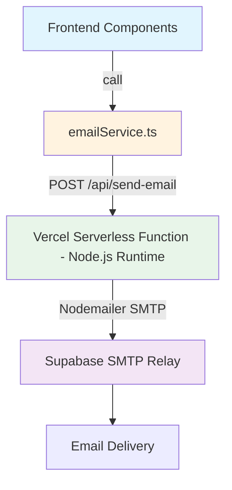

# Resend → Supabase SMTP Migration: Technical Analysis

## 1. Current Architecture Overview

### 1.1 Email Flow Diagram



### 1.2 Files Involved in Current Email System

| File | Role |
|------|------|
| [`supabase/functions/resend-email/index.ts`](supabase/functions/resend-email/index.ts) | Deno Edge Function — accepts POST, authenticates JWT, sends via Resend SDK |
| [`supabase/functions/resend-email/import_map.json`](supabase/functions/resend-email/import_map.json) | Maps `resend` to `npm:resend@2.0.0` |
| [`src/services/emailService.ts`](src/services/emailService.ts) | Frontend service — 3 exported functions, dual-path invocation with fallback |
| [`src/services/signatureService.ts`](src/services/signatureService.ts:5) | Consumer — calls `sendSignatureRequestEmail` for create and resend flows |
| [`src/services/documentService.ts`](src/services/documentService.ts:4) | Consumer — calls `sendSignatureRequestEmail` and `sendSignatureConfirmationEmail` |
| [`src/components/signatures/TestEmailButton.tsx`](src/components/signatures/TestEmailButton.tsx:5) | Consumer — calls `sendTestEmail` |
| [`email-server/server.js`](email-server/server.js) | Standalone Express proxy to Resend API — currently unused in production |
| [`.env`](.env) | Contains `VITE_RESEND_API_KEY` and Supabase credentials |

### 1.3 Email Types Currently Supported

| Template Type | Trigger | Function |
|---------------|---------|----------|
| `signature_request` | User requests a signature on a document | `sendSignatureRequestEmail` |
| `signature_confirmation` | Signer completes signing | `sendSignatureConfirmationEmail` |
| `test` | Admin tests email configuration | `sendTestEmail` |

### 1.4 Current Environment Variables

```
VITE_RESEND_API_KEY=re_boaNUsLQ_...     # Resend API key (EXPOSED in frontend bundle!)
RESEND_API_KEY                            # Set as Supabase secret for Edge Function
VITE_SUPABASE_URL                         # Supabase project URL
VITE_SUPABASE_ANON_KEY                    # Supabase anon key
VITE_APP_URL                              # App URL for building signature links
SUPABASE_URL                              # Used in Edge Function
SUPABASE_SERVICE_ROLE_KEY                 # Used in Edge Function for JWT verification
```

---

## 2. Proposed Target Architecture

### 2.1 Recommended Approach: Vercel Serverless API Route + Nodemailer



**Why this approach:**

1. **Nodemailer requires Node.js** — it cannot run in Deno Edge Functions
2. **Vercel Serverless Functions** are already available in your deployment — no new infrastructure needed
3. **SMTP credentials stay server-side** — no secrets leaked to the frontend bundle
4. **The existing `email-server/`** directory proves a Node.js proxy pattern was already considered

### 2.2 Alternative Approaches Considered

| Approach | Verdict | Reason |
|----------|---------|--------|
| **Deno SMTP in Edge Function** | ❌ Not recommended | No mature Deno SMTP library; TCP sockets restricted in Supabase Edge Functions; complex debugging |
| **Keep `email-server/` as separate service** | ❌ Not recommended | Requires separate hosting, always-on server, additional cost and maintenance |
| **Vercel Serverless Function** | ✅ Recommended | Zero new infrastructure, Nodemailer works natively, scales automatically, secrets stay server-side |

---

## 3. Architectural Changes Required

### 3.1 New File: `api/send-email.ts`

Create a Vercel API route at `api/send-email.ts`. This becomes the single email-sending endpoint replacing the Edge Function.

```
api/
  send-email.ts    ← New Vercel serverless function
```

**Key logic:**
- Parse request body with same `EmailRequest` interface
- Validate required fields: `to`, `subject`, and either `html`/`text`/`templateType`
- Create Nodemailer transporter using Supabase SMTP credentials
- Handle template rendering server-side (move templates from Edge Function)
- Send email via `transporter.sendMail()`
- Return consistent JSON response format

### 3.2 Modified File: `src/services/emailService.ts`

**Changes:**
- Remove `supabase.functions.invoke('resend-email', ...)` calls
- Remove direct `fetch()` to Edge Function URL fallback
- Replace with single `fetch('/api/send-email', ...)` call to Vercel serverless function
- Remove `EDGE_FUNCTION_URL` constant
- Remove `DEFAULT_FROM_EMAIL` constant (sender now configured server-side)
- Keep the same 3 exported function signatures for backward compatibility
- Remove duplicate HTML template functions (templates now live server-side only)

### 3.3 Modified File: `vercel.json`

**Changes:**
- The existing catch-all rewrite `/(.*) → /index.html` must be updated to exclude `/api/(.*)` routes
- Without this fix, Vercel would rewrite API calls to `index.html`

### 3.4 Files That Remain Unchanged

These files call `emailService.ts` functions and require **zero changes** since the function signatures stay the same:

- [`src/services/signatureService.ts`](src/services/signatureService.ts:5) — imports `sendSignatureRequestEmail`
- [`src/services/documentService.ts`](src/services/documentService.ts:4) — imports `sendSignatureRequestEmail`, `sendSignatureConfirmationEmail`
- [`src/components/signatures/TestEmailButton.tsx`](src/components/signatures/TestEmailButton.tsx:5) — imports `sendTestEmail`

### 3.5 Files to Deprecate/Clean Up

| File | Action |
|------|--------|
| [`supabase/functions/resend-email/index.ts`](supabase/functions/resend-email/index.ts) | Delete or archive — no longer needed |
| [`supabase/functions/resend-email/import_map.json`](supabase/functions/resend-email/import_map.json) | Delete or archive |
| [`deploy-resend-function.bat`](deploy-resend-function.bat) | Delete — no Edge Function to deploy |
| [`test-email-function.js`](test-email-function.js) | Update to test new `/api/send-email` endpoint |
| [`email-server/`](email-server/) directory | Delete — replaced by Vercel serverless function |
| [`README_EMAIL_INTEGRATION.md`](README_EMAIL_INTEGRATION.md) | Update to reflect SMTP setup |
| [`README_SUPABASE_EMAIL_SETUP.md`](README_SUPABASE_EMAIL_SETUP.md) | Update to reflect SMTP setup |

---

## 4. New Environment Variables

### 4.1 Server-Side Only (Vercel Environment Variables)

These are set in the Vercel dashboard under Project → Settings → Environment Variables. They are **never** exposed to the frontend bundle.

```
SMTP_HOST=smtp.supabase.co              # Supabase SMTP server hostname
SMTP_PORT=587                           # SMTP port (587 for STARTTLS, 465 for SSL)
SMTP_USER=your-project-ref.supabase.co  # SMTP username from Supabase dashboard
SMTP_PASS=your-smtp-password            # SMTP password from Supabase dashboard
SMTP_FROM_EMAIL=noreply@yourdomain.com  # Verified sender email address
SMTP_FROM_NAME=Knot To It               # Display name for sender
```

### 4.2 Variables to Remove

```
VITE_RESEND_API_KEY     # Remove from .env and Vercel — no longer needed
RESEND_API_KEY          # Remove from Supabase secrets — no longer needed
```

### 4.3 Variables That Stay Unchanged

```
VITE_SUPABASE_URL       # Still needed for Supabase client
VITE_SUPABASE_ANON_KEY  # Still needed for Supabase client
VITE_APP_URL            # Still needed for building signature URLs
```

---

## 5. Risk Analysis

### 5.1 Deliverability Impact — ⚠️ MEDIUM RISK

| Factor | Resend API | Supabase SMTP | Impact |
|--------|-----------|---------------|--------|
| IP Reputation | Dedicated, warmed IPs | Shared IPs (free tier) | Lower inbox placement rate |
| SPF/DKIM/DMARC | Auto-configured | Must configure in DNS | Misconfiguration = spam folder |
| Bounce Handling | Dashboard + webhooks | Limited visibility | Harder to monitor failures |
| Throttling | Generous rate limits | Stricter limits on free tier | May hit ceiling during bulk sends |

**Mitigation:**
- Configure SPF, DKIM, and DMARC DNS records for your sending domain
- Monitor Supabase email logs in the dashboard
- If deliverability drops, consider upgrading Supabase plan or using a dedicated SMTP relay like Amazon SES

### 5.2 SMTP Rate Limiting — ⚠️ MEDIUM RISK

Supabase SMTP rate limits by plan:

| Plan | Rate Limit |
|------|-----------|
| Free | ~3-5 emails/hour |
| Pro | ~100 emails/hour |
| Team | ~500 emails/hour |

**Current usage pattern analysis:**
- Your app sends emails for signature requests and confirmations — typically low volume
- The `resendSignatureRequest` function could cause bursts if users resend multiple times
- Batch operations (e.g., inviting many signers at once) could hit limits

**Mitigation:**
- Implement client-side rate limiting in `emailService.ts`
- Add a queue mechanism for bulk email sends
- Return HTTP 429 with retry-after header when limits are hit
- Monitor usage via Supabase dashboard

### 5.3 Security Considerations — 🔴 HIGH PRIORITY

| Issue | Current State | Required Fix |
|-------|--------------|--------------|
| **API key in frontend** | `VITE_RESEND_API_KEY` is in `.env` and gets bundled | ✅ Eliminated — SMTP creds are server-side only |
| **JWT auth on email endpoint** | Edge Function verifies Supabase JWT | Must implement in Vercel function — verify `Authorization` header |
| **CORS** | Edge Function has origin validation | Must validate origin in serverless function |
| **Input validation** | Basic field checks | Add email format validation, HTML sanitization, length limits |
| **SMTP credential storage** | N/A | Use Vercel encrypted environment variables, never commit to code |

### 5.4 Latency — 🟢 LOW RISK

| Factor | Resend API | Supabase SMTP |
|--------|-----------|---------------|
| Connection | HTTPS POST | SMTP handshake + STARTTLS |
| Typical latency | ~200-500ms | ~500-1500ms |
| Cold start | Edge Function ~100ms | Vercel function ~200ms |

**Mitigation:**
- Use Nodemailer connection pooling for repeated sends
- The slightly higher latency is acceptable for transactional emails

### 5.5 Edge Function Dependency — 🟢 LOW RISK

Removing the Edge Function eliminates:
- Deno runtime compatibility concerns
- `import_map.json` maintenance
- Supabase secret management for `RESEND_API_KEY`
- Edge Function cold starts and deployment complexity

---

## 6. Step-by-Step Logic Changes

### Step 1: Create Vercel Serverless Function

Create `api/send-email.ts`:

```
1. Import Nodemailer
2. Define EmailRequest interface (same as current)
3. Create SMTP transporter factory function
   - Read SMTP_HOST, SMTP_PORT, SMTP_USER, SMTP_PASS from process.env
   - Configure pool: true for connection reuse
   - Configure secure: false with requireTLS: true for port 587
4. Move all 3 HTML template functions from Edge Function
5. Export default handler function:
   a. Validate Authorization header with Supabase JWT
   b. Validate CORS origin
   c. Parse request body
   d. Validate required fields
   e. Render template if templateType is provided
   f. Call transporter.sendMail()
   g. Return JSON response
```

### Step 2: Update `emailService.ts`

```
1. Remove: import of supabase client (no longer needed for email)
2. Remove: EDGE_FUNCTION_URL constant
3. Remove: DEFAULT_FROM_EMAIL constant
4. Remove: All HTML template functions (now server-side)
5. Change: Each send function to call fetch('/api/send-email', ...)
   - Method: POST
   - Headers: Content-Type + Authorization from current session
   - Body: Same JSON structure as current
6. Simplify: Remove dual-path (invoke + fallback) logic — single endpoint now
7. Keep: Same function signatures and return types
```

### Step 3: Update `vercel.json`

```json
{
  "rewrites": [
    { "source": "/api/(.*)", "destination": "/api/$1" },
    { "source": "/(.*)", "destination": "/index.html" }
  ]
}
```

The API route rewrite must come BEFORE the catch-all SPA rewrite.

### Step 4: Install Nodemailer

```bash
npm install nodemailer
npm install -D @types/nodemailer
```

### Step 5: Configure Environment Variables

In Vercel Dashboard → Settings → Environment Variables, add:
- `SMTP_HOST`, `SMTP_PORT`, `SMTP_USER`, `SMTP_PASS`
- `SMTP_FROM_EMAIL`, `SMTP_FROM_NAME`
- `SUPABASE_URL`, `SUPABASE_ANON_KEY` (for JWT verification)

Remove from Vercel: `VITE_RESEND_API_KEY`

### Step 6: Clean Up Obsolete Files

- Delete or archive `supabase/functions/resend-email/`
- Delete `deploy-resend-function.bat`
- Update or delete `email-server/` directory
- Update documentation files

---

## 7. Implementation Todo List

These are the ordered steps for the Code mode implementation:

1. Install Nodemailer and its type definitions
2. Create `api/send-email.ts` with SMTP transport, JWT auth, CORS, templates
3. Rewrite `src/services/emailService.ts` to call `/api/send-email`
4. Update `vercel.json` to route `/api/*` correctly
5. Update `.env` to remove `VITE_RESEND_API_KEY`, document new SMTP vars
6. Delete obsolete files: `supabase/functions/resend-email/`, `deploy-resend-function.bat`, `email-server/`
7. Update documentation: `README_EMAIL_INTEGRATION.md`, `README_SUPABASE_EMAIL_SETUP.md`
8. Test email sending via `sendTestEmail` function
9. Verify signature request and confirmation email flows end-to-end

---

## 8. Nodemailer Configuration Reference

```typescript
import nodemailer from 'nodemailer';

const transporter = nodemailer.createTransport({
  host: process.env.SMTP_HOST,           // e.g., smtp.supabase.co
  port: Number(process.env.SMTP_PORT),   // 587
  secure: false,                          // false for STARTTLS on port 587
  requireTLS: true,                       // Force TLS upgrade
  auth: {
    user: process.env.SMTP_USER,
    pass: process.env.SMTP_PASS,
  },
  pool: true,                             // Connection pooling
  maxConnections: 5,
  maxMessages: 100,
  rateLimit: true,                        // Respect rate limits
  maxRetries: 3,
});
```

---

## 9. Summary of Breaking Changes

| Area | Before | After |
|------|--------|-------|
| Email transport | Resend SDK over HTTPS | Nodemailer over SMTP |
| Email endpoint | Supabase Edge Function | Vercel Serverless Function |
| Runtime | Deno | Node.js |
| Auth | Supabase JWT in Edge Function | Supabase JWT in Vercel Function |
| Secrets location | Supabase Secrets | Vercel Environment Variables |
| Frontend API key | `VITE_RESEND_API_KEY` exposed | No API key in frontend |
| Sender email | `onboarding@resend.dev` | Your verified domain email |
| Deployment | `supabase functions deploy` | Automatic with Vercel git push |
